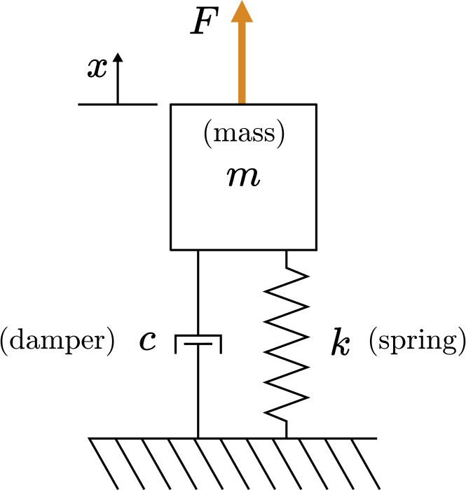
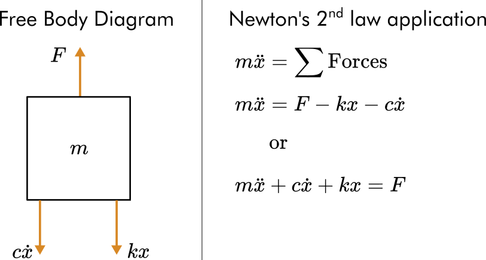
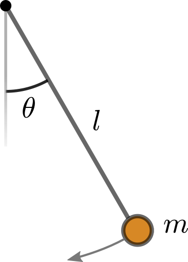

# 概要: ラプラス変換 (Laplace transforms) とLTIシステム (LTI systems)

伝達関数(Transfer functions)は 、線形時不変(linear time-invariant, LTI)システムのラプラス変換を計算することで導出されます。このライブスクリプトでは、ラプラス変換とLTIシステムの基本を復習します。

# ラプラス変換
## 定義

局所可積分関数 のラプラス変換は以下のように求めることができます。 

    

これに対応する逆ラプラス変換は以下の通りです。

    

逆ラプラス変換（順ラプラス変換も同様）は、通常は変換表を参照することで見つけることができます。逆ラプラス変換の正式な定義はほとんど使われないので、ここでは説明しません。

**  例題**

**(a) ** のラプラス変換を手計算で求めましょう。 ただしは0"/>のヘビサイドステップ関数(Heaviside step function)とします。

**(b) **[Symbolic Math Toolbox](https://www.mathworks.com/products/symbolic.html)を利用して、について解析的ラプラス変換を計算しましょう。

**解**

**(a)**

    

**(b) **[`laplace`](https://jp.mathworks.com/help/symbolic/sym.laplace.html)関数を使うと、シンボリック表現fについての解析解を求めることができます。構文は以下の通りです:

```matlab:Code(Display)
Fs = laplace(f,var,transformVar)
```

1. はじめにシンボリック変数を定義します。

```matlab:Code
syms t s
syms a positive
```

2. 次に関数fを定義します。Symbolic Math Toolbox に含まれる数学関数のリストについては[ドキュメント](https://www.mathworks.com/help/symbolic/mathematical-functions.html?s_tid=CRUX_lftnav)を参照してください。

```matlab:Code
f = heaviside(t-a)
```

f = 

   

3. 最後に、入力変数tと変換変数sを用いてラプラス変換を計算します。

```matlab:Code
Fs = laplace(f,t,s)
```

Fs = 

   

**  練習 **

1. 以下の標準的な関数について、ラプラス変換を手計算で求めましょう。ただし、 は実数かつ0"/>とします。


**ヒント:** **a/b.** 代入 (substitution), **c. **部分積分 (integration by parts), **d. **ディラックのデルタ関数 (Dirac delta function) - シンボリック式の計算を行う場合は[`dirac`](https://www.mathworks.com/help/symbolic/sym.dirac.html)関数が利用できます, **e/g. **部分積分後に項を整理する, **f.** 多重積分の部分積分 (multiple integrations by parts), 

2. 下の空欄にシンボリック演算でラプラス変換を計算し、手計算で求めた答えと比較・確認しましょう。

```matlab:Code
% Symbolic variable declarations
syms t s
syms a positive

% Compute Laplace transforms here

```

## ラプラス変換の可視化

 **やってみよう.** 下にあるコントロールスライダーを使ってラプラス変換を可視化しましょう。

```matlab:Code
syms t real
syms a b positive
```

変数, , を定義します:

```matlab:Code
m = 1; % Positive integer
anum = 1; % Positive constant
bnum = 1; % Positive constant
```

関数 を選択します:

```matlab:Code
f = dirac(t-a); 
```

軸の範囲を定義します:

```matlab:Code
trange = [-5, 5];
srange = [-5, 5];

generateSinglePlot(f,anum,bnum,trange,srange); % This local function generates the plots
```

  **考えてみよう **

   -  ラプラス変換で最もよく見られる関数の族 (class of functions) は何ですか？ 
   -  ラプラス変換の極 (pole) は、関数の時間領域関数の振る舞いをどのように反映していますか？ 

ラプラス変換と逆変換は、一般的に[このような表](https://en.wikipedia.org/wiki/List_of_Laplace_transforms#Table)を使って求めることができます。

## ラプラス変換の特性

ラプラス変換は、定義から導出されるいくつかの重要な性質を持ちます。以下、それらの性質について見ていきます。

    

訳注:

Time derivative: 時間微分

Time integral: 時間積分

Frequency shift: 位相シフト

Time shift: 時間シフト

Time scaling: 時間のスケーリング

Time domain convolution: 時間空間の畳み込み処理

  

例えば、時間微分のラプラス変換は、部分積分によって以下のように求められます:

    

 **やってみよう.** のシンボリック式による微分について、以下の構文を使って[シンボリック関数](https://jp.mathworks.com/help/symbolic/create-symbolic-functions.html)を宣言することで定義できます。

```matlab:Code(Display)
syms f(t)
```

微分は[`diff`](https://www.mathworks.com/help/matlab/ref/diff.html)関数を使って計算できます。

```matlab:Code
syms t f(t)
dfdt = diff(f)
```

 [`laplace`](https://www.mathworks.com/help/symbolic/laplace.html)関数を使って、下にある`dfdt`のラプラス変換を計算しましょう。

```matlab:Code
Fs = laplace(dfdt)
```

**  練習問題. **

**    a. **二階時間微分 (second time derivative) を、部分積分を２回繰り返す手計算で求めましょう。

**    b.** 手計算で求めた答えについて、シンボリック演算を使ったラプラス変換を行い、答えを確認しましょう。

 **Pro-tip**: 二次導関数を計算するには、[`diff`](https://www.mathworks.com/help/matlab/ref/diff.html) を使って、`diff(f,n)`という構文（nを導関数の次数）が使えます。

```matlab:Code
syms t f(t) % Definitions of the symbolic variables
% Perform your symbolic computations here
d2fdt2 = diff(f,2)
Fs = laplace(d2fdt2)
```

## ラプラス変換の特性を可視化する

 **やってみよう. **下にあるコントロールスライダーを使ってラプラス変換の要素を可視化してみましょう。

```matlab:Code
syms t real
syms a real
```

定数, を定義します:

```matlab:Code
m = 1; % Positive integer
anum = 1; % Constant
```

関数とプロパティを選択し、 を作成します。

```matlab:Code
f = sin(t);
g = diff(f);
```

軸の範囲を定義します:

```matlab:Code
trange = [-5, 5];
srange = [-5, 5];

generateDoublePlot(f,g,anum,0,trange,srange) % This local function generates the plots
```

## ラプラス変換を用いた微分方程式の解法

ラプラス変換を使うと、初期値問題を解析的に解くことができます。一般に、以下のステップによって解を求めることができます。

   1.  ラプラス変換を行う 
   1.  ラプラス領域 () で解変数を解く 
   1.  ラプラス変換表を参照し、ラプラス逆変換を行う 

**  練習問題. **ラプラス変換を使用して、バネ-マス-ダンパーの力学を解きます。

   -  一定の力 (constant forcing)  N 
   -  物理パラメータ:  kg,  Ns/m, and  N/m 
   \item{ 初期値はゼロ (zero initial conditions):  and  }

        

**解答.**

**1. 運動方程式を導出します.** 自由体図 (Free body diagram)を描き、ニュートンの第二法則を適用して運動方程式を導出できます。

        

**2. 動的システムODEのラプラス変換を計算し、****を解きます。**ヒント: .

    $$m[s^2 X-sx(0)-x^{\prime } (0)]+c[sX-x(0)]+kX=\frac{F}{s}$$

ゼロ初期条件と物理パラメータの値を適用すると、以下のようになります。

    

について解いてみます。

    

**3.  部分分数分解によって、****の式を逆ラプラス変換の方法が分かっている項に分離していきます。**

手計算で部分分数分解を行い、得られた結果を以下のシンボリック演算によって求められた解答と比較してください。

```matlab:Code
% Define X(s)
syms s 
X = 10/(s^3 + 2*s^2 + 10*s)
% Compute the partial fraction decomposition
Xdecomp = partfrac(X,s)
```

**4. 逆ラプラス変換を行います。**

[表](https://en.wikipedia.org/wiki/List_of_Laplace_transforms#Table)にある形で項の和としてを書き直すと、逆ラプラス変換を行うことができます。


逆変換を行って解を求めます:


別の方法として、シンボリック関数[`ilaplace`](https://www.mathworks.com/help/symbolic/sym.ilaplace.html)`を使って、`の逆ラプラス変換を求めることができます。

```matlab:Code
syms x
x = ilaplace(X) % The inverse Laplace transform of X(s)
```

**5. 解をプロットする**

チェックボックスをクリックして、解を表示しましょう。

```matlab:Code
plotSoln = false;

% Create solution array
t = linspace(0,5,150);
x = 1-exp(-t).*(cos(3*t) + 1/3*sin(3*t));
% This generates a plot (do not edit)
if(plotSoln)
    animateSingleMSD(t,x,0.5)
end
```

**  練習問題.** この演習では、ラプラス変換によって単振り子 (simple pendulum) の力学の問題を解きます。

              

**(a) **上に示した単振り子の自由体図を描き、長さ、重力定数9.8 m/sの振り子の運動方程式を導出してください。その方程式を 近傍で線形化して、次の式

      

と等価であることを示してください。

**(b) **ラプラス変換を使って、線形化された運動方程式を解いてください:

      

 ただし以下の初期条件とします。 .

求めた解答をシンボリック変数`t`を用いて変数`theta`に入れてください`。`チェックボックスをクリックすると、解答がプロットされます。

```matlab:Code
syms t
% Replace NaN with your symbolic solution and run the section
theta = NaN; 

plotSoln = false; 
% This generates a plot (do not edit)
if(plotSoln)
    plotPendulum(theta)
end
```

# 線型時不変システム (Linear time-invariant systems)

線型時不変システム（LTIシステム）は、名前が示す通りの２つの性質を持ちます: 線形性 (linearity)と時不変性 (time-invariance)です。 


> *Consider an operator ** that maps an input ** to an output **. *

**1. 線型性**

以下2つの性質を持っているならば、作用素 (operator) は線形である :

   -  重ね合わせ (Superposition):  
   -  斉次性 (Homogeneity) :  

この2つの特性は、しばしば以下のように1つにまとめて表記されます。

    

**2. 時不変性**

時間のずれ (time shift) を持つ入力が、同じ量の時間のずれを持つ出力信号を出力するとき、作用素は時不変性を持つ: 

   -   

**  練習問題.** この練習問題では、複数の未知の作用子が線形で時不変であるかどうかについて、その出力を調べることによって確認していきます。

**a. **入力値と出力値をグラフで示し、作用素 , , , が時不変性を持つかどうかを確認しましょう。

   -  作用素を変更するために、ドロップダウンリストを使います。 
   -  入力の時間のずれを変化させるために、`tau`を調整します。 

```matlab:Code
syms t
operator = "g"; % Select an operator
u = t^2/6; % Input function
tau = 1; 

plotInputsOutputs(u,tau,1,operator) 
```

**b.** 入力値と出力値をグラフで示し、作用素 , , ,  が斉次性の条件 () を満たすかどうかを確認しましょう。

   -  作用素を変更するために、ドロップダウンリストを使います。 
   -  入力のスケーリングを変更するために、 `a`の値を調整しましょう。 

```matlab:Code
operator = "g";
syms t
u = t^2/6; % Input function
a = 2.5; 

plotInputsOutputs(u,0,a,operator) 
```

**c.** 入力値と出力値をグラフで示し、作用素 , , ,  が重ね合わせの条件 ( ) を満たすかどうかを確認しましょう。

   -  作用素を変更するために、ドロップダウンリストを使います。 
   -   に について、異なる関数も試してみましょう。 

```matlab:Code
operator = "g";
syms t
u1 = t^2/6; % Input function 1
u2 = t^3/10; % Input function 2

plotAddition(u1,u2,operator)
```

  **考えよう. **上でグラフを生成するために使用した作用素は以下の通りです。どの作用素が線形ですか？どの作用素が時間不変ですか？あなたの答えは上のグラフで確認されたものと一致していますか？

   \item{ :  with  }
   -  :  
   \item{  }
   \item{ :  }

**Helper functions**

**Plots**

```matlab:Code
function generateSinglePlot(f,anum,bnum,trange,srange)
% This function plots a single transform pair
    colors = lines(2);
    figure("position",[0 0 1100 450])
    plotLaplace(f,anum,bnum,trange,srange,colors(1,:),colors(2,:),0.05,0.55,0.85,0.7) 
end

function generateDoublePlot(f,g,anum,bnum,trange,srange)
% This function plots two transform pairs together
    colors = lines(4);
    figure("position",[0 0 1100 500])
    plotLaplace(f,anum,bnum,trange,srange,colors(1,:),colors(2,:),0.05,0.55,0.85,0.63) % This local function generates the plots
    plotLaplace(g,anum,bnum,trange,srange,colors(3,:),colors(4,:),0.05,0.55,0.74,0.63) % This local function generates the plots
end
 
function plotLaplace(func,anum,bnum,trange,srange,c1,c2,p1,p2,py,vpos)
% This function plots a transform pair
    fs = 14; % fontsize
    funcName = inputname(1);
    
    % Compute the Laplace transform and generate functions
    syms s
    syms t real
    syms a b positive
    Fs = laplace(sym(func),t,s);
    Fs = collect(Fs);
    
    % Generate functions for plotting
    ffunc = matlabFunction(sym(func),"vars",[t a b]);
    Fsfunc = matlabFunction(Fs,"vars",[s a b]);
    fplotfunc = @(t)ffunc(t,anum,bnum);
    Fplotfunc = @(s)Fsfunc(s,anum,bnum);

    % Plot f(t) and label it with a latex function
    subplot("position",[0.05 0.1 0.4 vpos])
    hold on
    if(func == dirac(t-a))
        hold on
        plot([1,1]*anum,[0,1],"color",c1,"linewidth",1.5)
        plot(anum,1,"^","color",c1,"linewidth",1.5,"MarkerFaceColor",c1)
        plot(trange,0*trange,"linewidth",1.5,"color",c1)
        hold off
    elseif(func == 1)
        plot(trange,0*trange,"linewidth",1.5,"color",c1)
    else
        fplot(fplotfunc,trange,"linewidth",1.5,"color",c1)
    end
    hold off
    xlabel("$t$","Interpreter","latex","fontsize",fs)
    frange = get(gca,'ylim');
    frange = [frange(1) - diff(frange)/4, frange(2) + diff(frange)/4 ];
    axis([trange frange])
    ylabel("$"+funcName+"$","Interpreter","latex","fontsize",fs)
    textVal = "$$"+funcName+"(t) = "+latex(sym(func))+"$$";
    annotation("textbox","String",textVal,"Interpreter","latex","Color",c1,"VerticalAlignment","middle",...
        "fontsize",fs,"Position",[p1 py 0.1 0.1],"FitBoxToText","on","EdgeColor","none","BackgroundColor","white")
    
    % Plot F(s) and label it with a latex function
    subplot("position",[0.55 0.1 0.4 vpos])
    hold on
    if( Fs == 1 )
        plot(srange,0*srange,"linewidth",1.5,"color",c2)
    else
        fplot(Fplotfunc,srange,"linewidth",1.5,"color",c2)
    end
    hold off
    xlabel("$s$","Interpreter","latex","fontsize",fs)
    ylabel("$"+upper(funcName)+"$","Interpreter","latex","fontsize",fs)
    Frange = get(gca,'ylim');
    Frange = [Frange(1) - diff(Frange)/4, Frange(2) + diff(Frange)/4];
    axis([srange Frange])
    textVal = "$$"+upper(funcName)+"(s) = "+latex(sym(Fs))+"$$";
    annotation("textbox","String",textVal,"Interpreter","latex","Color",c2,"VerticalAlignment","middle",...
        "fontsize",fs,"Position",[p2 py 0.1 0.1],"FitBoxToText","on","EdgeColor","none","BackgroundColor","white")

end

function plotInputsOutputs(u,tau,a,operator)
% Plots operator input/output and annotates the plots with latex
    figure("position",[0 0 900 350])
    tlims = [-5 5];
    ylims = [-10 10];
    colors = lines(2);
    c1 = colors(1,:);
    c2 = colors(2,:);
    p1 = 0.05;
    p2 = 0.55;
    py = 0.85;
    vpos = 0.70;

    fs = 12; % fontsize
    
    % Apply operator and generate functions
    syms t
    u = a*subs(u,t,t-tau);
    uFunc = matlabFunction(u,"var",t);
    y = applyOperator(u,operator);
    yFunc = matlabFunction(y,"var",t);

    % Plot u(t) and label it with a latex function
    subplot("position",[0.05 0.12 0.4 vpos])
    fplot(uFunc,tlims,"linewidth",1.5,"color",c1)
    xlabel("$t$","Interpreter","latex","fontsize",fs)
    axis([tlims ylims])
    ylabel("$u$","Interpreter","latex","fontsize",fs)
    textVal = "$$"+latex(sym(u))+"$$";
    annotation("textbox","String",textVal,"Interpreter","latex","Color",c1,"VerticalAlignment","middle",...
        "fontsize",fs,"Position",[p1 py 0.1 0.1],"FitBoxToText","on","EdgeColor","none","BackgroundColor","white")
    
    % Plot y(t) and label it with a latex function
    subplot("position",[0.55 0.12 0.4 vpos])
    fplot(yFunc,tlims,"linewidth",1.5,"color",c2)
    xlabel("$t$","Interpreter","latex","fontsize",fs)
    ylabel("$y$","Interpreter","latex","fontsize",fs)
    axis([tlims ylims])
    textVal = "$$y(t)$$";
    annotation("textbox","String",textVal,"Interpreter","latex","Color",c2,"VerticalAlignment","middle",...
        "fontsize",fs,"Position",[p2 py 0.1 0.1],"FitBoxToText","on","EdgeColor","none","BackgroundColor","white")
end

function plotAddition(u1,u2,operator)

    figure("position",[0 0 1200 500])
    tlims = [-5 5];
    ylims = [-10 10];
    colors = lines(5);
    c1 = colors(1,:);
    c2 = colors(2,:);
    c3 = colors(3,:);
    c4 = colors(4,:);
    px1 = 0.05;
    px2 = 0.375;
    px3 = 0.7;
    py1 = 0.85;
    py2 = 0.75;
    vpos = 0.60;

    fs = 12; % fontsize
    
    % Apply operator and generate functions
    syms t
    u = u1 + u2;
    uFunc = matlabFunction(u,"var",t);
    u1Func = matlabFunction(u1,"var",t);
    u2Func = matlabFunction(u2,"var",t);
    
    y = applyOperator(u,operator);
    y1 = applyOperator(u1,operator);
    y2 = applyOperator(u2,operator);
    yFunc = matlabFunction(y,"var",t);
    y12Func = matlabFunction(y1+y2,"var",t);

    % Plot u(t) and label it with a latex function
    subplot("position",[px1 0.12 0.25 vpos])
    fplot(u1Func,tlims,"linewidth",1.5,"color",c1)
    hold on
    fplot(u2Func,tlims,"linewidth",1.5,"color",c2)
    hold off
    xlabel("$t$","Interpreter","latex","fontsize",fs)
    axis([tlims ylims])
    ylabel("$u$","Interpreter","latex","fontsize",fs)
    textVal = "$$u_1 = "+latex(sym(u1))+"$$";
    annotation("textbox","String",textVal,"Interpreter","latex","Color",c1,"VerticalAlignment","middle",...
        "fontsize",fs,"Position",[px1 py1 0.1 0.1],"FitBoxToText","on","EdgeColor","none","BackgroundColor","white")
    textVal = "$$u_2 = "+latex(sym(u2))+"$$";
    annotation("textbox","String",textVal,"Interpreter","latex","Color",c2,"VerticalAlignment","middle",...
        "fontsize",fs,"Position",[px1 py2 0.1 0.1],"FitBoxToText","on","EdgeColor","none","BackgroundColor","white")
    
    % Plot y(t) and label it with a latex function
    subplot("position",[px2 0.12 0.25 vpos])
    fplot(y12Func,tlims,"linewidth",1.5,"color",c3)
    xlabel("$t$","Interpreter","latex","fontsize",fs)
    ylabel("$y$","Interpreter","latex","fontsize",fs)
    axis([tlims ylims])
    textVal = "$$y_1(t) + y_2(t)$$";
    annotation("textbox","String",textVal,"Interpreter","latex","Color",c3,"VerticalAlignment","middle",...
        "fontsize",fs,"Position",[px2 py2 0.1 0.1],"FitBoxToText","on","EdgeColor","none","BackgroundColor","white")

    % Plot F(s) and label it with a latex function
    subplot("position",[px3 0.12 0.25 vpos])
    fplot(yFunc,tlims,"linewidth",1.5,"color",c4)
    xlabel("$t$","Interpreter","latex","fontsize",fs)
    ylabel("$y$","Interpreter","latex","fontsize",fs)
    axis([tlims ylims])
    textVal = "$$y(t)$$";
    annotation("textbox","String",textVal,"Interpreter","latex","Color",c4,"VerticalAlignment","middle",...
        "fontsize",fs,"Position",[px3 py2 0.1 0.1],"FitBoxToText","on","EdgeColor","none","BackgroundColor","white")

end

function y = applyOperator(u,operator)
    syms t
    if(operator == "g")
        y = diff(u,1) + diff(u,2);
    elseif(operator == "h")
        y = 4*sin(u).^2;
    elseif(operator == "i")
        y = int(3*u,t,t-1,t+1);
    else
        y = t*diff(u,1);
    end
end
 
function plotPendulum(thetaSym)
    try
        % This generates a plot (do not edit)
        t = linspace(0,5,150);
        thetaFunc = matlabFunction(thetaSym);
        thetaArray = thetaFunc(t);
        generatePendulumPlot(t,thetaArray,0.5)
    catch ME
        warning("Plotting failed with error: " + ME.message)
    end
end

function generatePendulumPlot(t,theta,l)
% Generates an animation of a single pendulum
% t: time array
% theta: angle array
% l: length of pendulum
    
    colors = lines(6);
    ms = 8;
    fs = 14;
    
    f = figure("position",[0,0,1200,700]);
    % Generate solution variables
    tlim = [min(t),max(t)];
    y = -l*cos(theta);
    x = l*sin(theta);
    
    % Setup the figure
    buff = 1.2;
    ymax = max([l/2,max(y)*buff]);
    axisLim0 = [tlim(1),tlim(2),min(theta)*buff,max(theta)*buff];
    axisLim1 = [tlim(1),tlim(2),-l*buff,ymax];
    axisLim2 = [-l*buff,l*buff,-l*buff,ymax];
    
    k = 1;
    % Create plot
    sp0 = subplot(2,2,1);
    xlabel("$t$","Interpreter","latex","fontsize",fs)
    ylabel("$\theta$","Interpreter","latex","fontsize",fs)
    hold on
    plot(t,theta,"color",colors(1,:),"linewidth",1.5);
    b = plot(t(k),theta(k),"o","markerfacecolor",colors(2,:),"markersize",ms);
    hold off
    axis(axisLim0)
    title("Angular displacement")
    box off
    
    sp1 = subplot(2,2,3);
    set(gca, "Clipping","off","Color","none"); 
    hold on
    plot(t,y,"k-","color",colors(1,:),"linewidth",1.5)
    e = plot([0, tlim(2)+(tlim(2)-tlim(1))*4], [y(k),y(k)],"-","color",[colors(4,:),0.5],"linewidth",1.5);
    f = plot([t(k), t(k)], [-l*buff,ymax+(ymax+l*buff)*4],"-","color",[colors(4,:),0.5],"linewidth",1.5);
    g = plot(t(k),y(k),"o","markerfacecolor",colors(2,:),"markersize",ms);
    hold off
    axis(axisLim1)
    box off
    xlabel("$t$ [s]","Interpreter","latex","FontSize",fs)
    ylabel("$y$ [m]","Interpreter","latex","FontSize",fs)
    title("Vertical position")
    
    sp2 = subplot(2,2,4);
    set(gca, "Clipping","off","Color","none");
    hold on
    d = plot([0,x(k)],[0,y(k)],"color",colors(1,:),"linewidth",1.5);
    c = plot(x(k),y(k),"o","markerfacecolor",colors(2,:),"markersize",ms*1.5);
    hold off
    axis equal
    axis(axisLim2)
    box off
    xlabel("$x$ [m]","Interpreter","latex","FontSize",fs)
    ylabel("$y$ [m]","Interpreter","latex","FontSize",fs)
    title("Position")
    
    % Create animation
    for k = 1:length(t)
        b.XData = t(k);
        b.YData = theta(k);
        c.XData = x(k);
        c.YData = y(k);
        d.XData = [0,x(k)];
        d.YData = [0,y(k)];
        e.YData = [y(k),y(k)];
        f.XData = [t(k),t(k)];
        g.XData = t(k);
        g.YData = y(k);
        pause(0)
    end
    drawnow
    close all
end

function animateSingleMSD(t,x,w)
% Generates an animation of a single mass/spring/damper
% t: time array
% x: displacement array
% w: width of the mass

    colors = lines(6); 
    fs = 14;
    
    % Create plot
    k = 1;
    f = figure("position",[0 0 1200 500]);
    
    % Setup the figure
    buffer = 1.2;
    xrange = max(x) - min(x);
    xmax = min(x) + xrange*buffer ;
    xmin = max(x) - xrange*buffer - w*1.5;
    tlim = [t(1) t(end)];
    axisLim1 = [tlim(1),tlim(2),xmin,xmax];
    axisLim2 = [-w*buffer,w*buffer,xmin,xmax];
    xground = xmin;
        
    sp1 = subplot(1,2,1);
    set(gca, "Clipping","off","Color","none"); 
    hold on
    plot(t,x,"k-","color",colors(1,:),"linewidth",1.5);
    a = plot([0, tlim(2)+(tlim(2)-tlim(1))*4], [x(k),x(k)],"-","color",[colors(4,:),0.5],"linewidth",1.5);
    b = plot(t(k),x(k),"o","markerfacecolor",colors(2,:),"MarkerSize",8);
    hold off
    axis(axisLim1)
    box off
    xlabel("$t$ [s]","Interpreter","latex","FontSize",fs)
    ylabel("$x$ [m]","Interpreter","latex","FontSize",fs)
    title("displacement")
        
    sp2 = subplot(1,2,2);
    set(gca, "Clipping","off","Color","none");
    hold on
    plot([-w*buffer w*buffer],[xground xground],'k-',"linewidth",1.5);
    
    % Plot mass
    x1 = x(k) - w/2;
    c = rectangle("Position",[-w/2 x1-w w w],"FaceColor",colors(1,:));
    
    % Plot spring
    xextension = x(k)-w;       
    xs = linspace(xground,xextension,12);
    ys = w/6*(-1).^(1:numel(xs)) - w/4;
    d = plot(ys,xs,"k","linewidth",1.5);
    % Plot damper
    ydamp = w/4;

    xdamp1 = xground + (xextension-xground)/2 + w*0.1;
    xdamp2 = xground + (xextension-xground)/2;
    xdamp3 = xground + (xextension-xground)/2 + w*0.2;
    e = plot([ydamp,ydamp,NaN,ydamp-w/10,ydamp+w/10],[xground,xdamp1,NaN,xdamp1,xdamp1],"k","linewidth",1.5);
    f = plot([ydamp-w*0.15,ydamp-w*0.15,NaN,ydamp+w*0.15,ydamp+w*0.15,NaN,ydamp-w*0.15,ydamp+w*0.15,NaN,ydamp,ydamp],...
        [xdamp2,xdamp3,NaN,xdamp2,xdamp3,NaN,xdamp3,xdamp3,NaN,xdamp3,xextension],"k","linewidth",1.5);
    
    hold off
    axis equal
    axis(axisLim2)
    ax = gca;
    ax.XAxis.Visible = 'off'; 
    title("diagram")

    % Create animation
    for k = 1:length(t)
        % displacement
        a.YData = [x(k),x(k)];
        b.XData = t(k);
        b.YData = x(k);
        % mass
        c.Position = [-w/2,x(k)-w,w,w];
        xextension = x(k)-w;       
        % spring
        d.YData = linspace(xground,xextension,12);
        % damper
        xdamp1 = xground + (xextension-xground)/2 + w*0.1;
        xdamp2 = xground + (xextension-xground)/2;
        xdamp3 = xground + (xextension-xground)/2 + w*0.2;
        e.YData = [xground xdamp1 NaN xdamp1 xdamp1];
        f.YData = [xdamp2 xdamp3 NaN xdamp2 xdamp3 NaN xdamp3 xdamp3 NaN xdamp3 xextension]; 
        pause(0)
    end
    drawnow
    close all
        
end

% Suppress unused suggestions
%#ok<*NASGU> 
```
