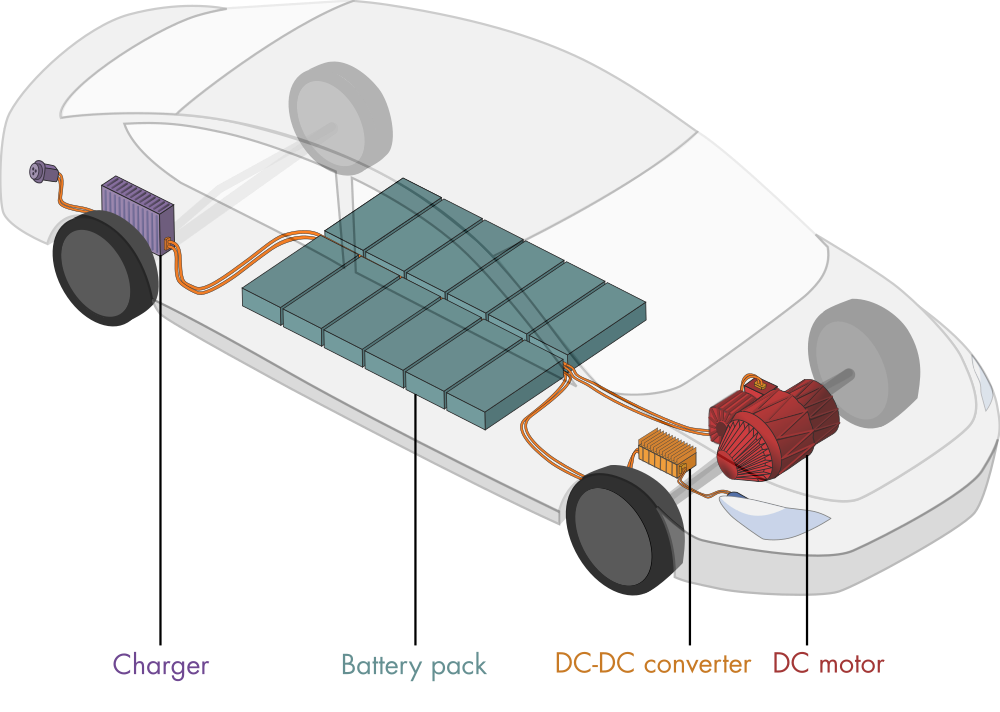
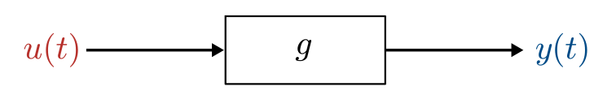
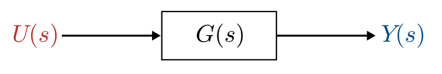
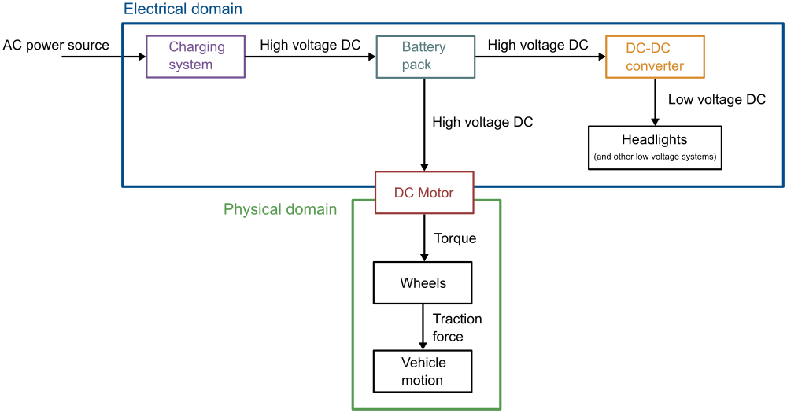
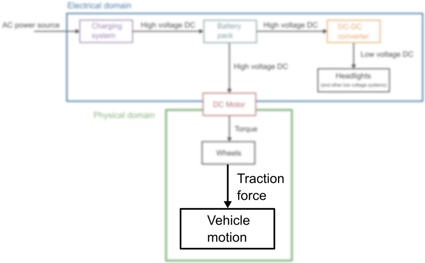
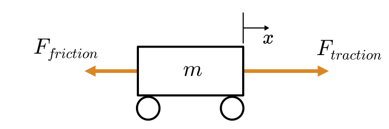
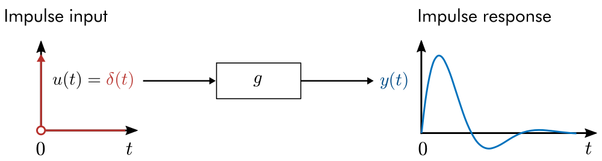
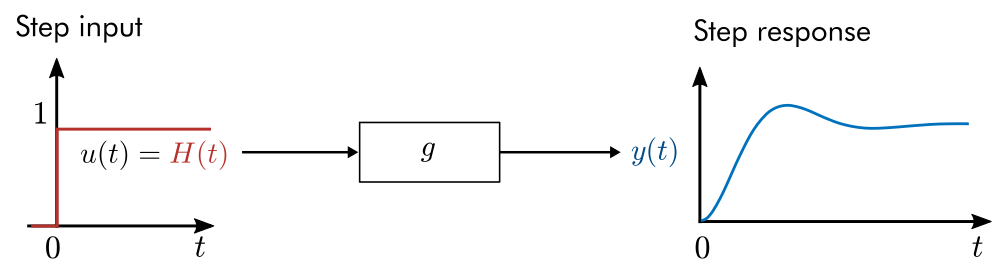
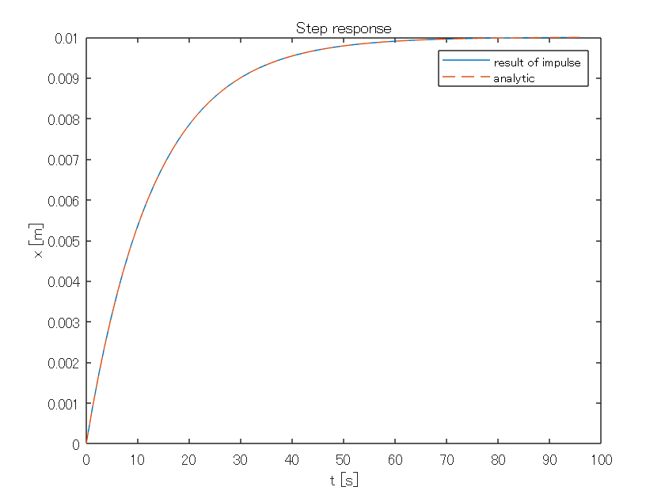
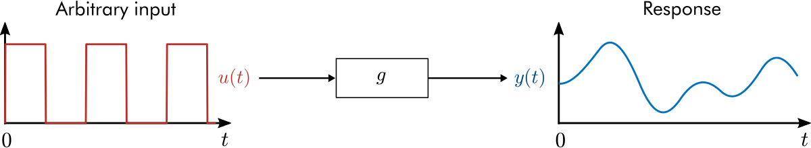

# 電気自動車: the wave of the future?

（訳者注： the wave of the futureは「最先端のもの」という意味があり、伝達関数の波とかけています）

  



> *Essential components of an electric vehicle*

電気自動車 (Electric vehicles, EV) は、環境に配慮した持続可能な移動手段の未来形かもしれません。しかし、ガソリン車よりも高効率を持ちながら、高速で加速・維持するのに十分なパワーをEVが備えているのはなぜでしょうか。その答えは、EVの効率的なパワーエレクトロニクスにあります。このモジュールでは、伝達関数について学び、これを活かして電気自動車の重要な要素のダイナミクスを解析してみます。

# 伝達関数の基礎

 このライブスクリプトは、コードを見ながら実行する前提で作られています。「ビュー」タブを選択し、「インラインで出力」を選択してください。


# 伝達関数の定義

単一の入力関数と単一の出力関数を持つ力学系について考えてみます:

    

これは**SISO** (Single Input Single Output, 一入力一出力) システムと呼ばれているものです。一般的に、システムは微分方程式によって定義されます: .

**伝達関数** (transfer function) は以下のように定義され:

    ,

出力のラプラス変換と入力のラプラス変換.の比です。伝達関数は、入力を出力に写像します:

     

  ラプラス変換の復習が必要な方はこちらを参照ください: [Part0_ConceptReview.mlx](matlab: open Part0_ConceptReview.mlx). このリンクはPart0_ConceptReview.mlx が現在のフォルダまたは MATLAB Search Path にある場合のみ有効です。

** 練習問題. **任意の関数で強制入力を受けるバネ-マス-ダンパーの伝達関数を求めよ。系は初期状態では静止している( and )とします。

      

        *Mass-spring-damper diagram*

**解答. **バネ-マス-ダンパーの方程式は

    

微分に対するラプラス変換の性質を利用すると、ラプラス変換は

            

 と を適用して:

    

入力と出力の比を求めると、伝達関数が得られます:

    

** 練習問題. **線形化された運動方程式を用いて、初期条件がゼロの単振り子の伝達関数を求めましょう。振り子が任意の強制関数(forcing function) で駆動されていると考えてください（強制関数の角度依存性があれば、にそれを加味します）。運動方程式は次のようになります:

    

は重力による加速度、は振り子の長さです。あなたの解答を、シンボリック変数 `g`, `l`, `s`を用いて `pendulumTF` に記述してください。

```matlab:Code
syms g l s 
% Record your answer in pendulumTF
pendulumTF = NaN;
checkPendulumTF(pendulumTF) % Checks your answer
```

# 電気自動車の力学系

ここでは、電気自動車（EV）の電気系と機械系の構成のダイナミクスについて、伝達関数を用いて調べます。EVシステムの主要な構成は下図のように表現されます。



> *Simplified EV power system*

この図において、電気的な領域と物理的な領域という2つの領域が表現されています。DCモーターは、電気エネルギーを機械エネルギーに変換することで、両領域を結合しています。電気的な領域では、2つの重要な変換が行われます。

   -  交流電源（120/240V）を直流高圧電源（200〜800V）に変換し、バッテリーパックを充電します。 
   -  バッテリーの高電圧DC（200-800V）は、低電圧システムで使用するために、降圧コンバータ (buck converter) によって低電圧（12Vまたは48V）に変換されます。 

この章では、EVで利用されている（もしくは実際に使われているものと同様のもの）典型的な構成部を調べてみます。

# 単純な車両運動を伝達関数で表現してみる

電気自動車のシステムにおいて、最も直感的に理解できる部分は、車両そのものの動きです。



> *In this live script, you'll focus on modeling the motion of the vehicle.*

単純なモデルについて考えると、牽引力(traction force)と摩擦力(frictional force)の2つの力が作用する単純な質量としてEVをモデル化できます。牽引力は、モーターが車輪にトルクを与えることで発生します



> *A simple vehicle model*

** 例題. (a) **単純な車両モデルの運動方程式を導出し、　(b) 牽引力を入力関数として、車体の変位 の伝達関数を求めましょう。

**解答. **

**(a) **車体の変位はです。問題をシンプルにするために、摩擦力は比例定数で速度 に比例すると仮定して:

    

牽引力はモーターの出力によって変化するため（モデルに含まれない検討材料です）、任意の関数として扱っておきます:

    

この２つの力についてニュートンの第二法則をあてはめます:

    

**(b) **運動方程式のラプラス変換を計算すると

    

ゼロ初期条件を適用してを解くと

    

 **注意.** この車両モデルは様々な部分で簡略化を行っています (特に摩擦力をモデル化する方法について)。このモデルは、実際の機械システムに存在する力を正確に説明するものではなく、伝達関数の本質的な概念を説明することを意図して作られています。

** 練習問題. **位置ではなく、速度を解析したい場合もあるでしょう。運動方程式を

    

速度について書き直し、伝達関数 : を解いてください。シンボリック変数 `s`, `m`, `k`を使い、解答を`Vtf`に格納し、コードを実行して結果を確認してみてください。

```matlab:Code
syms m s k % Symbolic variable declarations
% Record your answer here
Vtf = NaN;

checkVTF(Vtf) % Checks your answer
```

# インパルス応答

システムのインパルス応答 (impulse response) は、インパルス入力から生成される出力です。一般的には自然応答と呼ばれることもあります。

       

*        Response of a system to an impulse. While the response may be computed in the **-domain, it is shown in the time domain.*

ここで、は次のような特性を持つディラックのデルタ関数 (Dirac delta function) です:

       and   

単位インパルスは、時刻においてシステムに（非常に）素早い衝撃を与えるものだと考えてください。インパルス応答は、その衝撃に対してシステムがどのように応答するかを示します。

**  考えてみよう.** 単純な車両運動モデルを考えてみます。入力関数は牽引力です．インパルス入力は、時刻の瞬間的な力に相当します。

        

   -  位置伝達関数のインパルス応答を、時間領域でプロットしてみてください。 
   -  速度伝達関数のインパルス応答を、時間領域でプロットしてみてください。 

** 例題. **バネ-マス-ダンパーのインパルス応答を初期値ゼロ、パラメータ , ,  でプロットしてください。

      

        *Mass-spring-damper diagram*

バネ-マス-ダンパー系の伝達関数を思い出してみましょう:

    

**解答.**

MATLABで、[`tf`](https://www.mathworks.com/help/control/ref/tf.html)関数を使って伝達関数を定義し、その応答を[`impulse`](https://www.mathworks.com/help/control/ref/lti.impulse.html)関数で評価することで、インパルス応答を計算できます。

`tf`関数の構文は

     `tf(num,denom)`

ここで `num` は分子の係数、`denom` は分母の係数を降順で表します。注意点としては、`tf` 関数で作成した伝達関数はシンボリック関数ではないので、Symbolic Math Toolbox で扱うことはできません。

 の分子と分母は以下のように定義されます。

```matlab:Code
m = 1; % Default: 1
c = 0.1; % Default: 0.1
k = 0.4; % Default: 0.4
num = [0 0 1];
denom = [m c k];
```

`tf` を呼び出して伝達関数を作ります。

```matlab:Code
G = tf(num,denom)
```

インパルス応答をプロットするには、以下の構文で`impulse`関数を呼び出します:

```matlab:Code(Display)
impulse(H,tFinal)
```

`H` は伝達関数、`tFinal` はシミュレーションの継続時間です。

```matlab:Code
impulse(G,100)
ylabel("x [m]")
```

**  考えてみよう.** 

   -  減衰 (damping) とバネの剛性(stiffness)  は、インパルス応答にどのような影響を与えますか？ 
   -   を0.5まで増やすと、応答はどのように変化しますか？ 
   -  としてインパルス応答を再計算をしてみてください。 
   -  としてインパルス応答を再計算してみてください。 

** 練習問題. **質量が1300kg、摩擦の比例定数 (frictional constant of proportionality)  Ns/mである単純な車両について考えます。単純な車両の運動モデルについての伝達関数があることを思い出してください:

    

MATLABのコマンドを使って、インパルス応答`G`の最初の100秒間をプロットしてください。以下の２点を満たすようにしてください。

   1.  `tf` 関数を使って伝達関数を作成する 
   1.  `impulse`関数を使ってインパルス応答をプロットする 

```matlab:Code
% Write your code here

```

**  考えてみよう.** 

   -  プロットしたインパルス応答は、あなたが予想していたものと比較してどうでしょうか？ 
   -  物理的には、インパルス応答の長期的な挙動は何を表現しているでしょうか？ 
   \item{ 速度伝達関数を定義し、下の（コードを書く）ブロックでインパルス応答を計算しましょう。物理的には、限界動作 (limiting behavior) は何を表しますか？ }

```matlab:Code
% Write your code here

```

# ステップ応答

ステップ入力から生成される出力は、ステップ応答 (step respone) と呼ばれます。

    

*       Response of a system to a step input.*

ステップ応答は時間領域でプロットされます。ステップ応答は、一定の強制力を持続させた場合におけるシステムの応答と考えられます。車両モデルにおいて、モーターを連続的に動作させた場合（一定の牽引力を出力するという仮定）にこのような応答が生じるはずです。

**  考えてみよう.** 単純な車両運動モデルについて考えます。入力関数は牽引力です。

        

   -  位置伝達関数のステップ応答について、時間領域でプロットしてみてください。 
   -  速度伝達関数のステップ応答について、時間領域でプロットしてみてください。 

** 練習問題. **質量が1300kg、摩擦の比例定数  Ns/mである単純な車両について考えます。単純な車両の運動モデルについての伝達関数があることを思い出してください:

    

MATLABの`tf`関数を使って伝達関数 `G` を定義し、`step`関数を使ってステップ応答の最初の30秒間をプロットしてください。`step`関数は以下のような記法で使います

`    step(sys,Tfinal)`

ただし`sys`は動的システム（ここでは、伝達関数の`G`)で、`Tfinal`はシミュレーションを停止する時間です。

```matlab:Code
% Write your code here

```

**  考えてみよう.** 

   -  求めたステップ応答は、あなたの予測と比べてどうですか？ 
   -  初期の過渡的な挙動 (transient behavior) は、どのような物理的作用を反映しますか？ 
   -  ステップ応答の長期的な挙動は何を反映しますか？ 

** 練習問題. **先ほど同様、質量が1300kg、摩擦の比例定数  Ns/mである単純な車両について考えます。今度は、位置にかわって速度 を解析します。速度の伝達関数は次のようにかけるのを思い出してください:

    

速度の伝達関数についてステップ応答を計算し、これを用いて単位ステップの外力 (forcing) を受けた車両の最大速度を求めてください。

```matlab:Code
% Write your code here

```

**  考えてみよう.** 

   -  気づいているかもしれませんが、単位ステップの外力では、車両の最高速度はたったの0.01m/s（時速約0.022マイル）です。これは、単位ステップでの牽引力が1Nしかなく、1300kgの車体を動かすには到底足りません。 
   -  より現実的な応答を作りだすためには、伝達関数に定数をかけることでシステムにゲインを追加し、ステップのレスポンスを再計算します。最大速度 50 m/s（または 112 mph）とするゲイン定数は値はいくらでしょうか？ 
   \item{ `gain`は最大速度 50m/s を発生させるゲイン定数とした場合、ステップ応答\texttt{H*gain}を下のコードブロックで計算してください。 }
   -  どのくらいの時間で 0 から 60 mph (0 から 26.8m/s) まで車両は加速しますか？ 

```matlab:Code
% Write your code here

```

# インパルス応答とステップ応答の解析的計算

ここまでで、「インパルス応答とステップ応答はどのように計算されるのか？」と思ったかもしれません。MATLABでは、それらの応答は数値的に推定されます。多くの一般的な場合、応答を解析的に導き出すことも可能です。実際の運用場面では解析的な応答を求めることは通常は不要ですが、さらに直感を養うための貴重な練習になります。

インパルス応答またはステップ応答を解析的に解くためには、:

   1.  入力関数のラプラス変換をとる 
   1.  を解く  
   1.  を（ラプラス）逆変換しての時間領域の応答をとる 

1.を手計算で求めるのを避けたい場合、ラプラス変換表や`laplace`関数を利用できます。3.の手順は、変換表やSymbolic Math Toolbox の[`ilaplace`](https://www.mathworks.com/help/symbolic/ilaplace.html) 関数を使って実行できます。

  

 **例題. **

**(a) **単純な車両モデルについて、位置伝達関数を用いて解析的なインパルス応答を計算しましょう。

**(b)** , とします。解析的なインパルス応答の結果をプロットし、`impulse`関数を用いて求めた解と比較しましょう。

**解答. **

**(a) **単純な車両モデルの位置伝達関数を思い出しましょう:

    

まず、入力である外力の関数のラプラス変換を計算します:

    

つまり

    

ここで、変換表を参照したり、`ilaplace`関数を使って逆ラプラス変換を計算できます。

```matlab:Code
syms m k positive
syms s x
X = 1/(m*s^2 + k*s)
x = ilaplace(X)
```

**(b)** `tf`関数によって伝達関数を定義してから、インパルス応答を計算します。

```matlab:Code
m = 1300;
k = 100;
Xs = tf([0 0 1],[m k 0]);
[x,t] = impulse(Xs);
```

今度は同じ区間について解析解を計算し、比較した結果をプロットしましょう。

```matlab:Code
xAnalytic = 1/k - exp(-k*t/m)/k;
plot(t,x,t,xAnalytic,'--')
legend("result of impulse", "analytic")
xlabel("t [s]")
ylabel("x [m]")
title("Step response")
```



 **練習問題. **

**(a)** 車両の位置伝達関数の解析的**ステップ**応答を計算しましょう。この単純な車両モデルの位置伝達関数は以下のものであったことを思い出しましょう:

    

あらかじめ定義されているシンボリック変数を使って、出力をシンボリック変数`x`に格納してください。

```matlab:Code
% Use these symbolic variables
syms m k real
syms s x 

% Compute the symbolic form of the step response and store it in x
x = NaN
checkAnalyticStep(x)
```

**(b)** , とします。(a)で計算した解析的なステップ応答の結果をプロットしてください。`step`関数で計算したステップ応答も同様にプロットしましょう。

```matlab:Code
% This computes the step response 
m = 1300;
k = 100;
Xs = tf([0 0 1],[m k 0]);
[x,t] = step(Xs,20);
```

定数`k` と `m`を用いて、解析解を配列 `t`について計算しましょう。結果を`step`関数の出力と一緒にプロットしてください。

```matlab:Code
% Create your plot here

```

# 強制応答 (forced response)

任意の入力関数 に対するシステムの応答を計算することもできます。

        

        *Response of a system to a square wave.*

解析的には、  の逆ラプラス変換を計算し、続けての逆ラプラス変換を求めることで、システムの応答を計算することができます。解析的に求められる式が存在しない場合は、 [`lsim`](https://www.mathworks.com/help/control/ref/lti.lsim.html) 関数を用いて数値的に応答を推定できます。

 **やってみよう.**

ここでは、バネ-マス-ダンパー系の応答を解析していきます

        

バネ-マス-ダンパー系は静止状態から始まり、入力関数で駆動されているとします。

**その1.** ライブスクリプトの挙動に慣れましょう。

   1.  ドロップダウンリストを使って入力関数 `u `を変えて、応答を観察します。 
   1.  バネ-マス-ダンパーのパラメーターと入力周波数を調整し、応答の変化を観察します。 
   1.  "animate"というボックスにチェックを入れると、バネ-マス-ダンパーのアニメーションが表示されるようになります。このアニメーションの表示のオンとオフの切り替えは、この後の作業においても自由に変更可能です。 

**その2. ** 共振周波数を求めましょう。

   1.  システムが共振周波数で駆動されると不安定になる現象はよく知られています。`tfinal`を長くしてシミュレーション時間を長くしてみましょう。システムは共振周波数で駆動されていますか？ 
   1.  過渡応答 (transient response) は、駆動周波数とバネ-マス-ダンパーの固有周波数 (natural frequency) という2つの周波数で特徴付けられることに気づくと思います。オシレーターの固有振動数は、駆動（入力）周波数より大きいでしょうか、それとも小さいでしょうか？ 
   1.  入力周波数をバネ-マス-ダンパーの固有周波数と同じになるようにしてください。共振振動 (resonant pscillations) が見られますか？ 
   1.  減衰の値をゼロにしましょう。共振周波数に近い地点では、応答が無制限に大きくなることが観察されるはずです。 
   1.  別の入力関数を使ってオシレーターを駆動してみてください。入力関数の選択は共振振動に影響を与えていますか？ 

```matlab:Code
m = 1; % Default: 1
c = 0.1; % Default: 0.1
k = 1; % Default: 1
freq = 0.25; % Frequency in Hz. Default: 0.25
tfinal = 30; % Simulation duration. Default: 30
t = linspace(0,tfinal,500);
u = sin(2*pi*freq*t).^2;
animate = false;
 

% Compute and plot the response
G = tf([0 0 1],[m c k]); % The transfer function
[x,t] = lsim(G,u,t); % Simulate the response using lsim
if(~animate)
    plotResponse(t,u,x) % regular plot
else 
    animateSingleMSD(t,x,u,0.5,200) % animated response
end
```

 **練習問題. **この練習問題では、正弦波入力関数に対するバネ-マス-ダンパーの解析的応答を計算し、その結果を`lsim`を使って計算された値と比較します。ここでは、バネ-マス-ダンパーのパラメータを, , とします。伝達関数は次のようになります

        

解析解を求める計算は、手計算で行うこともできますし、MATLABのSymbolic Math Toolboxを使用することもできます。シンボリック演算を行うときは、はじめにシンボリック変数を宣言してください。例えば:

```matlab:Code(Display)
syms f real   % Real symbolic variable f
syms t s      % Symbolic variables t and s
```

**(a) **入力関数のラプラス変換を計算しましょう:

     

ただし は定数 (Hz単位での周波数)とします。

```matlab:Code
% Write your code here

```

**(b)**  ラプラス領域における応答の式を求めましょう。

```matlab:Code
% Write your code here

```

**(c) **の逆ラプラス変換を計算し、時間領域の応答を求めましょう。

```matlab:Code
% Write your code here

```

**(d)** の解析的応答を区間上で求め、結果をプロットしましょう。

**ヒント**：MATLABのシンボリック演算で を計算した場合、自分で式を書き出して計算する代わりに、[`matlabFunction`](https://www.mathworks.com/help/symbolic/matlabfunction.html) で関数ハンドルに変換し、値を求めることができます。例えば:

```matlab:Code(Display)
xfunc = matlabFunction(x)    % Create a function handle for a symbolic expression x
xeval = xfunc(freq,t);       % Evaluate the function handle based on its input arguments
```

```matlab:Code
% Write your code here

```

**(e) **同じ応答について、今度は[`lsim`](https://www.mathworks.com/help/control/ref/lti.lsim.html)関数を使って計算し、解析的な応答と一緒にプロットしてください。

```matlab:Code
% Write your code here

```

\matlabheading{さらに学びたい人のために}

   -  MATLABでの伝達関数の使い方についての紹介ビデオ: [Transfer Functions in MATLAB](https://www.mathworks.com/videos/transfer-functions-in-matlab-100912.html). 
   -  バネ-マス-ダンパーについてもっと深く学びたいですか? こちらをご覧ください [Mass-Spring-Damper Systems courseware](https://www.mathworks.com/academia/courseware/mass-spring-damper-systems.html) 
   -  MATLAB Tech Talkでシステムの応答についてもっと学びましょう: [Control Systems in Practice, Part 9: The Step Response](https://www.mathworks.com/videos/control-systems-in-practice-part-9-the-step-response-1593067191882.html). 
   -  理論についてもう少し詳しく知りたいですか? Brian Douglasのビデオをどうぞ: [Control Systems Lectures - Transfer Functions](https://www.youtube.com/watch?v=RJleGwXorUk). 

**Helper functions**

**Plots**

```matlab:Code
function plotResponse(t,u,x)
% This function generates a response plot
    figure("position",[0 0 1000 300])
    
    subplot(1,2,1)
    plot(t,u,"color",[0.7176 0.1922 0.1725],"linewidth",1.5)
    xlabel("t")
    ylabel("u(t)")
    box off
    axis([t(1),t(end),min(u)-0.2,max(u)+0.2])
    title("Input function")
    
    subplot(1,2,2)
    plot(t,x,"linewidth",1.5,"color",[0 0.4470 0.7410])
    xlabel("t")
    ylabel("x(t)")
    xlim([t(1) t(end)])
    title("Response")
    box off
end

function animateSingleMSD(tin,xin,uin,w,Npoints)
% Generates an animation of a single mass/spring/damper
% t: time array
% x: displacement array
% w: width of the mass

    % Interpolate to Npoints
    t = linspace(tin(1),tin(end),Npoints);
    x = interp1(tin,xin,t);
    u = interp1(tin,uin,t);

    colors = lines(6); 
    fs = 14;
    
    % Create plot
    k = 1;
    figure("position",[0 0 1500 400]);
    
    % Setup the figure
    buffer = 1.2;
    xrange = max(x) - min(x);
    xmax = min(x) + xrange*buffer ;
    xmin = max(x) - xrange*buffer - w*1.5;
    tlim = [t(1) t(end)];
    axisLim1 = [tlim(1),tlim(2),xmin,xmax];
    axisLim2 = [-w*buffer,w*buffer,xmin,xmax];
    xground = xmin;
    
    subplot(1,3,1);
    plot(tin,uin,"color",[0.7176 0.1922 0.1725],"linewidth",1.5)
    xlabel("$t$ [s]","Interpreter","latex","FontSize",fs)
    ylabel("$u(t)$ [N]","Interpreter","latex","FontSize",fs)
    box off
    axis([t(1),t(end),min(u)-0.2,max(u)+0.2])
    title("Input function")
    
    subplot(1,3,2);
    set(gca, "Clipping","off","Color","none"); 
    hold on
    plot(tin,xin,"k-","color",colors(1,:),"linewidth",1.5);
    a = plot([0, tlim(2)+(tlim(2)-tlim(1))*4], [x(k),x(k)],"-","color",[colors(4,:),0.5],"linewidth",1.5);
    b = plot(t(k),x(k),"o","markerfacecolor",colors(2,:),"MarkerSize",8);
    hold off
    axis(axisLim1)
    box off
    xlabel("$t$ [s]","Interpreter","latex","FontSize",fs)
    ylabel("$x$ [m]","Interpreter","latex","FontSize",fs)
    title("displacement response")
        
    subplot(1,3,3);
    set(gca, "Clipping","off","Color","none");
    hold on
    plot([-w*buffer w*buffer],[xground xground],'k-',"linewidth",1.5);
    % Plot mass
    x1 = x(k) - w/2;
    c = rectangle("Position",[-w/2 x1-w w w],"FaceColor",colors(1,:));
    % Plot spring
    xextension = x(k)-w;       
    xs = linspace(xground,xextension,12);
    ys = w/6*(-1).^(1:numel(xs)) - w/4;
    d = plot(ys,xs,"k","linewidth",1.5);
    % Plot damper
    ydamp = w/4;
    xdamp1 = xground + (xextension-xground)/2 + w*0.1;
    xdamp2 = xground + (xextension-xground)/2;
    xdamp3 = xground + (xextension-xground)/2 + w*0.2;
    e = plot([ydamp,ydamp,NaN,ydamp-w/10,ydamp+w/10],[xground,xdamp1,NaN,xdamp1,xdamp1],"k","linewidth",1.5);
    f = plot([ydamp-w*0.15,ydamp-w*0.15,NaN,ydamp+w*0.15,ydamp+w*0.15,NaN,ydamp-w*0.15,ydamp+w*0.15,NaN,ydamp,ydamp],...
        [xdamp2,xdamp3,NaN,xdamp2,xdamp3,NaN,xdamp3,xdamp3,NaN,xdamp3,xextension],"k","linewidth",1.5);
    
    hold off
    axis equal
    axis(axisLim2)
    ax = gca;
    ax.XAxis.Visible = 'off'; 
    title("diagram")

    % Create animation
    for k = 1:length(t)
        % displacement
        a.YData = [x(k),x(k)];
        b.XData = t(k);
        b.YData = x(k);
        % mass
        c.Position = [-w/2,x(k)-w,w,w];
        xextension = x(k)-w;       
        % spring
        d.YData = linspace(xground,xextension,12);
        % damper
        xdamp1 = xground + (xextension-xground)/2 + w*0.1;
        xdamp2 = xground + (xextension-xground)/2;
        xdamp3 = xground + (xextension-xground)/2 + w*0.2;
        e.YData = [xground xdamp1 NaN xdamp1 xdamp1];
        f.YData = [xdamp2 xdamp3 NaN xdamp2 xdamp3 NaN xdamp3 xdamp3 NaN xdamp3 xextension]; 
        pause(0)
    end
    drawnow
    close all
end
```

**Checks**

```matlab:Code
function correct = isEqualCheck(userSubmission,correctAnswer)
% This function checks if two results are equal and displays feedback
    correct = true;
    if( isequal(userSubmission, correctAnswer) )
        disp("Correct!")
    else
        warning("Your answer does not match the expected result.")
        correct = false;
    end
end

function checkPendulumTF(userSubmission)
    syms s g l
    pendulumTF = 1/(s^2 + g/l);
    isEqualCheck(simplify(sym(userSubmission)),simplify(pendulumTF));
end

function checkVTF(userSubmission)
    syms m s k
    Vtf = 1/(m*s + k) ;
    isEqualCheck(simplify(sym(userSubmission)),simplify(Vtf));
end

function checkAnalyticStep(userSubmission)
    syms m k real
    syms s x t
    Us = laplace(heaviside(t));
    X = 1/(m*s^2 + k*s )*Us;
    x = ilaplace(X);
    isEqualCheck(x,userSubmission);
end
```
